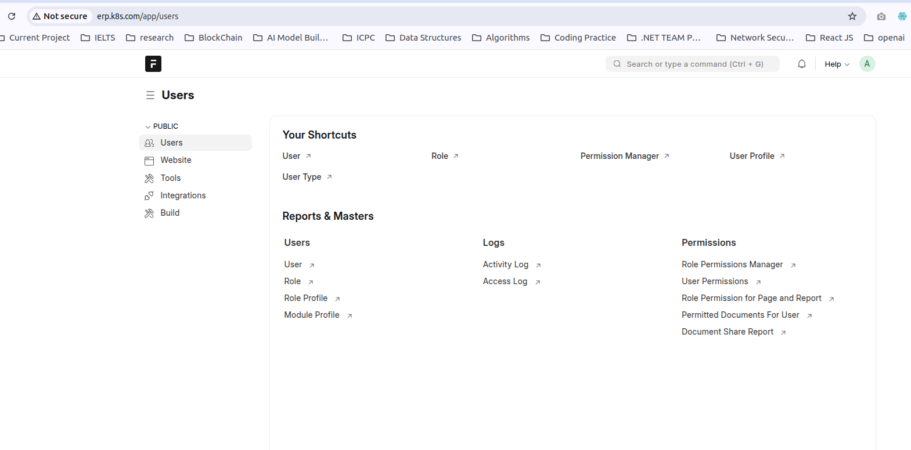

# K8S Installation 

# Prepare VM

```
# Note: the below changes to be done on vms (master nodes & worker nodes)

disable swap

    swapoff -a 
    vi /etc/fstab 
	comment the swap line putting hash infront of the line
	ex: #UUID=9fb8bc78-f247-4b69-8b4a-44171adeda7b none            swap    sw              0       0
```  

# Step1: On Master Node Only

```
## Install Containerd
sudo wget https://raw.githubusercontent.com/lerndevops/labs/master/scripts/installContainerd.sh -P /tmp
sudo bash /tmp/installContainerd.sh
sudo systemctl restart containerd.service

## Install kubeadm,kubelet,kubectl
sudo wget https://raw.githubusercontent.com/lerndevops/labs/master/scripts/installK8S.sh -P /tmp
sudo bash /tmp/installK8S.sh

## Initialize kubernetes Master Node

   sudo kubeadm init --ignore-preflight-errors=all

   sudo mkdir -p $HOME/.kube
   sudo cp -i /etc/kubernetes/admin.conf $HOME/.kube/config
   sudo chown $(id -u):$(id -g) $HOME/.kube/config

   ## install networking driver -- Weave/flannel/canal/calico etc...

   ## below installs calico networking driver

   kubectl apply -f https://raw.githubusercontent.com/projectcalico/calico/v3.24.1/manifests/calico.yaml

   # Validate:  kubectl get nodes
```

# Step2: On All Worker Nodes

```
## Install Containerd
sudo wget https://raw.githubusercontent.com/lerndevops/labs/master/scripts/installContainerd.sh -P /tmp
sudo bash /tmp/installContainerd.sh
sudo systemctl restart containerd.service

## Install kubeadm,kubelet,kubectl
sudo wget https://raw.githubusercontent.com/lerndevops/labs/master/scripts/installK8S.sh -P /tmp
sudo bash /tmp/installK8S.sh

## Run Below on Master Node to get join token

kubeadm token create --print-join-command

    copy the kubeadm join token from master & run it on all nodes

    Ex: kubeadm join 10.128.15.231:6443 --token mks3y2.v03tyyru0gy12mbt \
           --discovery-token-ca-cert-hash sha256:3de23d42c7002be0893339fbe558ee75e14399e11f22e3f0b34351077b7c4b56
```           


# Allow required permissions for All Nodes

```
sudo ufw allow 6443/tcp
sudo ufw allow 2379-2380/tcp
sudo ufw allow 179/tcp
sudo ufw allow 4789/udp
sudo ufw allow proto 4
```

# Install Helm on Master Node 

```
curl -fsSL -o get_helm.sh https://raw.githubusercontent.com/helm/helm/main/scripts/get-helm-3
chmod 700 get_helm.sh
./get_helm.sh
```

# Install and configure NFS Server 

```


sudo apt update
sudo apt install nfs-kernel-server -y

sudo mkdir -p /srv/nfs/mongodb
sudo mkdir -p /srv/nfs/backend-images

sudo chown nobody:nogroup /srv/nfs/mongodb
sudo chown nobody:nogroup /srv/nfs/backend-images

sudo chmod 777 /srv/nfs/mongodb
sudo chmod 777 /srv/nfs/backend-images

sudo nano /etc/exports

/srv/nfs/mongodb 192.168.10.0/24(rw,sync,no_subtree_check,no_root_squash)
/srv/nfs/backend-images 192.168.10.0/24(rw,sync,no_subtree_check,no_root_squash)

sudo exportfs -rav
sudo systemctl restart nfs-kernel-server
sudo ufw allow from 192.168.10.0/24 to any port nfs
sudo ufw allow 111/tcp
sudo ufw allow 111/udp
sudo ufw allow 2049/tcp
sudo ufw allow 2049/udp
sudo ufw allow 32765:32769/tcp
sudo ufw allow 32765:32769/udp
```


# Install NFS Client all the nodes in cluster

```
sudo apt install nfs-common -y
```

# NFS Provisioner on K8s Master Node 

```
helm repo add nfs-subdir-external-provisioner https://kubernetes-sigs.github.io/nfs-subdir-external-provisioner/

helm install nfs-provisioner nfs-subdir-external-provisioner/nfs-subdir-external-provisioner \
  --set nfs.server=192.168.10.143 \
  --set nfs.path=/srv/nfs \
  --set storageClass.name=nfs-client
```  

# Check NFS Status on Master Node

```
kubectl get storageclass
kubectl get pod -w
```

# Install Metallb

```
kubectl apply -f https://raw.githubusercontent.com/metallb/metallb/v0.14.9/config/manifests/metallb-native.yaml

kubectl get pods -n metallb-system
kubectl get svc -n metallb-system

kubectl edit svc -n metallb-system
```

# Configure Metallb

* Crate file `nano loadbalancer/metallb-config.yaml`


```
apiVersion: metallb.io/v1beta1
kind: IPAddressPool
metadata:
  name: private-ip-pool
  namespace: metallb-system
spec:
  addresses:
  - 192.168.10.68-192.168.10.69 #Use your private IP Series

---
apiVersion: metallb.io/v1beta1
kind: L2Advertisement
metadata:
  name: private-l2-advertisement
  namespace: metallb-system
spec:
  ipAddressPools:
  - private-ip-pool

```

* Deploye Metallb `kubectl apply -f loadbalancer/metallb-config.yaml`
* Notes: `Change the type from ClusterIP to NodePort (or LoadBalancer if using a cloud provider).`


# Nginx Ingress 

```
helm repo add ingress-nginx https://kubernetes.github.io/ingress-nginx
helm repo update
helm install ingress-nginx ingress-nginx/ingress-nginx --namespace ingress-nginx --create-namespace


kubectl get pods -n ingress-nginx

kubectl get svc -n ingress-nginx

# Change the type from ClusterIP to NodePort (or LoadBalancer if using a cloud provider).

kubectl edit svc ingress-nginx-controller -n ingress-nginx
```


# Necessary Others 

```
# Uninstall NFS 
helm uninstall nfs-provisioner

# Validate Helm file 
helm lint .
helm template --debug .
```

# Install ERPNext 

```
https://github.com/excel-azmin/erpnext-helm.git -t nfs

helm install erpnext ./erpnext-helm .

kubectl get pods

# Once all pods are running 

kubectl exec -it deploy/erpnext-gunicorn -- bash

# Create Site 

bench new site erp.cluster.local

```

# Make sure site name is same if you are using `$$host`



# Extra Notes

```
helm install erpnext  ./erpnext-helm -f ./erpnext-helm/values.yaml
kubectl get ingress

kubectl exec -it deploy/erpnext-gunicorn -n default -- ls /home/frappe/frappe-bench/sites

chmod -R 775 /home/frappe/frappe-bench/sites
chown -R frappe:frappe /home/frappe/frappe-bench/sites

kubectl rollout restart deployment erpnext-gunicorn
kubectl rollout restart deployment erpnext-nginx

```

# Access Mariadb 

```
kubectl exec -it erpnext-mariadb-0 -- bash
```
# Access Frappe terminal 

```
kubectl exec -it deploy/erpnext-gunicorn -- bash
```

# create site 

```
kubectl exec -it deploy/erpnext-gunicorn -- bash
cd frappe-bench

bench new-site erp.k8s.com \
  --admin-password changeit \
  --mariadb-root-password changeit \
  --install-app erpnext

```

# Restart Services

```
kubectl rollout restart deployment erpnext-gunicorn
kubectl rollout restart deployment erpnext-nginx
```


# Configure HA Load Balancer Server

# Nginx-HA-with-keepalived

To set up a High Availability (HA) NGINX load balancer with Keepalived, we will configure two NGINX instances and use Keepalived for failover management. The goal is to ensure that if one NGINX instance goes down, the other instance takes over, providing high availability.

# Assumptions:

The IP addresses of your NGINX servers are:

* NGINX-1: 192.168.10.199

* NGINX-2: 192.168.10.195

Keepalived will handle failover and virtual IP (VIP) management.

1. Install NGINX on Both Servers :

On both servers (192.168.10.199 and 192.168.10.195), install NGINX:

```
sudo apt update
sudo apt install nginx
```

2. Configure NGINX :

Edit the NGINX configuration on both servers to ensure they are set up to load balance your backend servers (for example, two application servers).

# NGINX Configuration:

```
# /etc/nginx/nginx.conf

http {
    upstream backend {
        server 192.168.10.100;  # Example backend server 1
        server 192.168.10.101;  # Example backend server 2
    }

    server {
        listen 80;
        server_name your_domain.com;

        location / {
            proxy_pass http://backend;
            proxy_set_header Host $host;
            proxy_set_header X-Real-IP $remote_addr;
            proxy_set_header X-Forwarded-For $proxy_add_x_forwarded_for;
            proxy_set_header X-Forwarded-Proto $scheme;
        }
    }
}

```

Make sure both NGINX servers have identical configurations. After editing, restart NGINX:

```
sudo systemctl restart nginx
```

3. Install Keepalived :
   
On both servers (192.168.10.199 and 192.168.10.195), install Keepalived:

```
sudo apt update
sudo apt install keepalived
```

4. Configure Keepalived :
   
Now, you’ll configure Keepalived to manage the VIP (Virtual IP) that will be moved between NGINX instances.

On NGINX-1 (192.168.10.199) – Master Configuration:

```
# /etc/keepalived/keepalived.conf

vrrp_instance VI_1 {
    state MASTER
    interface eth0              # Change to your interface name
    virtual_router_id 51
    priority 101                # Master server has higher priority
    advert_int 1
    virtual_ipaddress {
        192.168.10.200          # VIP that will be shared between NGINX instances
    }
}
```

On NGINX-2 (192.168.10.195) – Backup Configuration:

```
# /etc/keepalived/keepalived.conf

vrrp_instance VI_1 {
    state BACKUP
    interface eth0              # Change to your interface name
    virtual_router_id 51
    priority 100                # Backup server has lower priority
    advert_int 1
    virtual_ipaddress {
        192.168.10.200          # Same VIP as the MASTER
    }
}
```

5. Start Keepalived :

Enable and start Keepalived on both servers:

```
sudo systemctl enable keepalived
sudo systemctl start keepalived
```

6. Verify the Setup :

On NGINX-1: Check if the VIP (192.168.10.200) is assigned:

```
ip addr show
```

On NGINX-2: Similarly, check that the VIP is not assigned here when NGINX-1 is the master.

7. Testing Failover :

To test failover, you can stop Keepalived on NGINX-1 (Master):

```
sudo systemctl stop keepalived
```

This should trigger NGINX-2 (Backup) to take over the VIP (192.168.10.200). You can verify this by checking the IP address on NGINX-2:

```
ip addr show
```

Once Keepalived is restarted on NGINX-1, it should regain control of the VIP.

8. Ensure Keepalived and NGINX Start on Boot :

Make sure that both services start on boot:

```
sudo systemctl enable nginx
sudo systemctl enable keepalived
```

# Conclusion

This setup provides high availability for your NGINX load balancer with automatic failover. If one NGINX server goes down, the other will take over the virtual IP, ensuring continuous service availability.


# Install Certbot and NGINX Plugin


```
sudo apt install certbot python3-certbot-nginx -y
```

# Update `hosts` file

```
nano /etc/hosts

# Set domain with K8S Loadbalancer Floating IP From Metallb

192.168.10.68	erp.k8s.com
```

# Configuration

Define the Upstream in `nginx.conf`

Edit the NGINX configuration file:

```
sudo nano /etc/nginx/nginx.conf
```

**Add the following content:**

```
user www-data;
worker_processes auto;
pid /run/nginx.pid;

events {
    worker_connections 1024;
}

http {
    upstream lms_k8s {
        # Backend server pool
        server erp.k8s.com max_fails=3 fail_timeout=30s;
    }

    include       /etc/nginx/mime.types;
    default_type  application/octet-stream;

    log_format    main '$remote_addr - $remote_user [$time_local] "$request" '
                      '$status $body_bytes_sent "$http_referer" '
                      '"$http_user_agent" "$http_x_forwarded_for"';
    access_log    /var/log/nginx/access.log  main;
    error_log     /var/log/nginx/error.log;

    sendfile        on;
    keepalive_timeout 65;
    types_hash_max_size 2048;

    include /etc/nginx/conf.d/*.conf;
    include /etc/nginx/sites-enabled/*;
}

```

**Enable Access Logging**

Create a new configuration file for the site:

```
sudo nano /etc/nginx/sites-available/
```

**Add the following:**

* Zone the `lms-web.arcapps.org` domain with your loadbalancer IP

```
server {
    server_name lms-web.arcapps.org;
  
    location / {
        proxy_pass http://lms_k8s;
        proxy_http_version 1.1;
        proxy_set_header Upgrade $http_upgrade;
        proxy_set_header Connection "upgrade";
        proxy_set_header Host erp.k8s.com; # Force backend to use expected Host
        proxy_set_header X-Forwarded-Host $host;
        proxy_set_header X-Real-IP $remote_addr;
        proxy_set_header X-Forwarded-For $proxy_add_x_forwarded_for;
        proxy_set_header X-Forwarded-Proto $scheme;
    }

    # Let’s Encrypt challenge support
    location ^~ /.well-known/acme-challenge/ {
        default_type "text/plain";
        root /var/www/html;
        allow all;
    }

}

```

**Testing and Reloading Configuration**


Enable the new site and disable the default configuration:

```
sudo ln -s /etc/nginx/sites-available/ /etc/nginx/sites-enabled/
sudo rm /etc/nginx/sites-enabled/default
```

**Test the NGINX configuration:**

```
sudo nginx -t
```

**Reload NGINX:**

```
sudo systemctl reload nginx
```

**SSL Integration**

Obtain a New SSL Certificate

Run Certbot to obtain and configure SSL:

```
sudo certbot --nginx -d lms-web.arcapps.org
```

**Verify SSL Installation**
To confirm the SSL certificate installation:

```
sudo certbot certificates
```

**Reload NGINX:**

```
sudo systemctl reload nginx
```

**Validation**

Open https://lms-web.arcapps.org in a browser to verify access.
Check WebSocket functionality in Blazor apps.
Confirm sticky sessions by observing consistent server responses during testing.

**Maintenance**

Renew SSL Certificates Automatically: Certbot automatically handles renewal. To manually test renewal:

```
sudo certbot renew --dry-run
```

**Monitor Logs:**

  * Access logs: `/var/log/nginx/access.log`
  * Error logs: `/var/log/nginx/error.log`


# Install Grafana

```
helm repo add grafana https://grafana.github.io/helm-charts
helm repo update

kubectl get ingress -n grafana


helm upgrade --install grafana grafana/grafana \
  --namespace grafana \
  --create-namespace \
  --set service.type=LoadBalancer \
  --set adminPassword='admin' \
  --set ingress.enabled=true \
  --set ingress.hosts[0]=grafana.example.com \
  --set ingress.annotations."nginx\.ingress\.kubernetes\.io/ssl-redirect"='"false"' \
  --set ingress.paths[0]='/' \
  --set ingress.ingressClassName=nginx
```

# Check Grafana Status 

```
kubectl get pods -n grafana
kubectl get ingress -n grafana
kubectl get svc -n grafana

# Get Grafana default password
kubectl get secret --namespace grafana grafana -o jsonpath="{.data.admin-password}" | base64 --decode ; echo
```


# Install Prometheus

```
helm repo add prometheus-community https://prometheus-community.github.io/helm-charts
helm repo update

helm install prometheus prometheus-community/kube-prometheus-stack \
  --namespace monitoring \
  --create-namespace \
  --set grafana.enabled=false 

```

# Check Prometheus Status 

```
kubectl --namespace monitoring get pods -l "release=prometheus"
kubectl --namespace monitoring get svc prometheus-kube-prometheus-prometheus
```

# Connect Grafana and Prometheus

```
# set Prometheus data source URL : Set the URL to http://prometheus-kube-prometheus-prometheus.monitoring:9090.

kubectl apply -f - <<EOF
apiVersion: v1
kind: ConfigMap
metadata:
  name: grafana-datasources
  namespace: grafana
data:
  prometheus.yaml: |-
    {
        "apiVersion": 1,
        "datasources": [{
            "access": "proxy",
            "editable": true,
            "name": "Prometheus",
            "orgId": 1,
            "type": "prometheus",
            "url": "http://prometheus-kube-prometheus-prometheus.monitoring:9090",
            "version": 1
        }]
    }
EOF

```


# Check Prometheus and Grafana 

```
kubectl get configmap grafana-datasources -n grafana -o yaml

```

# Add Grafana Dashboard


* Grafana Dashboard List: `15661`, `741`, `747`, `19105`

# Install ArgoCD

```
helm repo add argo https://argoproj.github.io/argo-helm
helm repo update

kubectl create namespace argocd


helm install argocd argo/argo-cd \
  --namespace argocd \
  --set server.ingress.enabled=true \
  --set server.ingress.ingressClassName=nginx \
  --set server.ingress.hosts='{argocd.example.com}' \
  --set server.ingress.paths='{/}' \
  --set server.ingress.annotations."nginx\.ingress\.kubernetes\.io/ssl-redirect"="false" \
  --set server.extraArgs='{--insecure}'

```  

# if you want to upgrade anything 

```
helm upgrade --install argocd argo/argo-cd \
  --namespace argocd \
  --set server.ingress.enabled=true \
  --set server.ingress.ingressClassName=nginx \
  --set server.ingress.hosts='{argocd.example.com}' \
  --set server.ingress.paths='{/}' \
  --set server.ingress.annotations."nginx\.ingress\.kubernetes\.io/ssl-redirect"="false" \
  --set server.extraArgs='{--insecure}'
```  

# Check ArgoCD Status 

```
kubectl get ingress -n argocd
kubectl get pods -o wide -n argocd
kubectl get svc -o wide -n argocd

#Get Password
kubectl get secret argocd-initial-admin-secret -n argocd -o jsonpath="{.data.password}" | base64 -d

```

